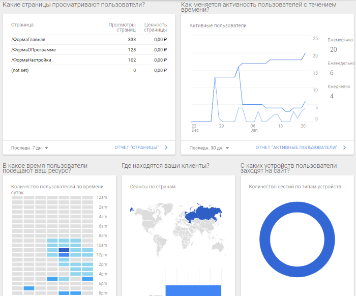
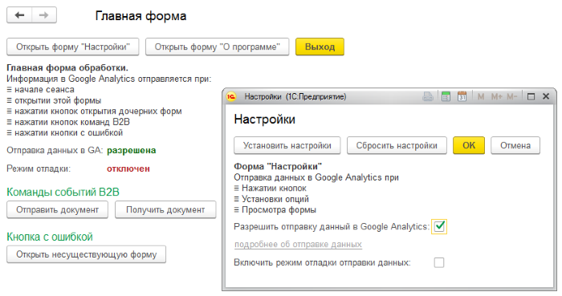

# GA_LIB Google Analytics + 1C:Enterprise

Google Analytics + 1C:Enterprise sample | Пример обработки отправки статистики в Google Analytics.

## Что это?

Репозиторий содержит исходный код демонстрационной обработки для отправки статистики на сайт analytics.google.com 
Библиотеки для работы с Google Analytics позволяет отправлять статистику о:
* аудитории пользователей обработки
* местоположение пользователей
* переходах по формам обработки
* событиях интерфейса пользователя
* событиях бизнес-логики обработки
* ошибках
* системную информацию и информацию о версиях

Библиотека для отправки данных в Google Analytics реализована в виде управляемой формы обработки "модGA". Библиотека содержит публичный методы и публичные поля. Библиотеку необходимо встроить в собственную обработку и в контролируемых местах обработки вызывать методы отправки данных в GA.

Данная разработка результат совместной работы сотрудников нашей компании. Коллега заложил основы проекта. Я сделал демонстрационный пример и это описание.

## Как подключить и внедрить?

1. Заведите аккаунт на сайте  analytics.google.com и получите идентификатор отслеживания.
2. Скопируйте в свою обработку форму "модGA" из демонстрационной обработки.
3. В основной форме вашей обработки инициализируйте библиотеку, так, как это сделано в примере.
4. Добавьте вызов метода отправки данных в GA во все контролируемые места вашей обработки.
5. Добавьте опцию отключения отправки данных в GA и текст дисклеймера на форме настройки вашей обработки.
6. Настройте отчеты на сайте  analytics.google.com

## Устройство библиотеки

Интерфейс библиотеки описан в публикации ["А чё это вы здесь делаете, а?"](https://infostart.ru/public/723481/) на сайте infostart.ru

## Встраивание библиотеки в собственную обработку

Принцип встраивания библиотеки в обработку описан в публикации ["А чё это вы здесь делаете, а?"](https://infostart.ru/public/723481/) на сайте infostart.ru
